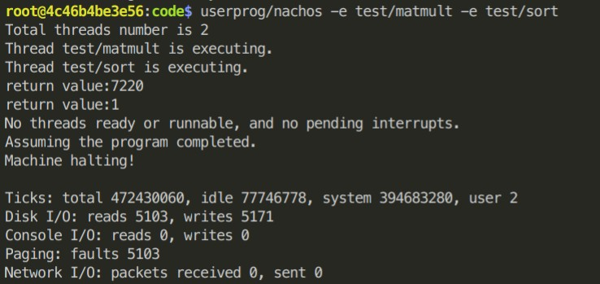

# Memory management on NachOS

<p align='right'>2019Fall OS Project3</p>
<p align='right'>EE4 B05901064 林承德</p>
## Motivation
The original Nachos doesn't support the virtual memory and swap space, resulting to the limit of the pysical memory. Therefore I need to implement a memory manager with the following function:
* Save a page to the disk.
* Replace a page by **LRU**(Least Recently Used) algorithm.
* Maintain the page table, frame table, and swap table.


## Implementation

### FrameTable and SwapTable
Both FrameTable and SwapTable are the array of FrameInfoEntry, whose length are numbers of physical pages or disk sectors. Each FrameInfoEntry represent a single frame/sector.
```c++ 
class FrameInfoEntry {
    bool valid; // if the frame/sector use of not.
    // It's corresponding pageTable and virtual page number from Process.
    TranslationEntry *pageTable;
    unsigned int vpn; 
    // record when did the frame page be used last time 
    unsigned count;
};
```


### Memory Manger

The goal of the memory manager is to maintain the page table from each process, frame table, and swap table. In addition, it need to handle the page fault and select which physical page to store to the disk by the **LRU** algorithm.

```c++
class MemoryManager {
  public:
    bool AccessPage(TranslationEntry *pageTable, int vpn);
    // called in Machine::translate to access a page
    // if page is not found, implement the page fault handler.
    // update the count in frameTable to record the last used time.
    
    bool AcquirePage(TranslationEntry *pageTable, int vpn);
    // called in AddrSpace::Load to request a new virtual page
    // if physical pages are full, save a page to disk.
    
    void ReleaseAll(TranslationEntry *pageTable, int num);
	// called when the process finishes
    // return all the virtual pages to the OS.
    
  private :
    FrameInfoEntry *frameTable;
    FrameInfoEntry *swapTable;
    unsigned count; // current count for LRU algorithm
    
    bool RestorePage(TranslationEntry *pageTable, int vpn, int ppn);
    // bring the virtual page from the disk to physical memory.
    
    int  SavePage();
    // store the virtual page from the memory to disk.
    // use LRU algorithm to select which physical page to store.
    // return the physical page number which is selected to store to disk.
};
```


### LRU(Least Recently Used)

When the machine calls `machine::translate()` function, it will also calls `MemoryManager::AccessPage()` function. In latter function,  memory manager set the `count` of the corresponding physical page to its own `count` and add 1 to its own `count`. Therefore ,  the less value of `count` of physical page, the longer time since it was used last time.

If the page fault happens, the memory manager will choose the physical manager which has the least value of `count` to replace to the request page.


### Load

Since the virtual page might not be continuous on physical page, we need to write only one page at once. Therefore, we need to maintain the file address and virtual address during the writing process. 

```c++
bool AddrSpace::Load(char *fileName) {
    pageTable = new TranslationEntry[numPages];
    int codeVaddr    = noffH.code.virtualAddr;
    int codeFileAddr = noffH.code.inFileAddr;
    int codeSize     = 0;
    for(unsigned i = 0; i < numPages; ++i){
        ASSERT(kernel->machine->memmgr->AcquirePage(pageTable, i) );
        if(i == codeVaddr / PageSize && codeSize < noffH.code.size) {
            DEBUG(dbgAddr, "Initializing code segment.");
            int phyaddr = pageTable[i].physicalPage * PageSize + codeVaddr % PageSize;
            int wrsize = PageSize - codeVaddr % PageSize;
            if (codeSize + wrsize > noffH.code.size) wrsize = noffH.code.size - codeSize;
            executable->ReadAt(&(kernel->machine->mainMemory[phyaddr]), wrsize, codeFileAddr);

            codeVaddr    += wrsize;
            codeFileAddr += wrsize;
            codeSize     += wrsize;
        }
    }
}
```


## Result

### Experiment result



There are 5103 page faults, therefore the disk reads 5103 times to replace the physical page.


### Extra observation

```c++
void AddrSpace::SaveState() {
    if(kernel->machine->pageTableSize){
        pageTable=kernel->machine->pageTable;
        numPages =kernel->machine->pageTableSize;
    }
}
```

When context switch occurs, the kernel calls `SaveState()` . However, when saving physical pages  to disk during loading the program, the page table of kernel is none. It results to the missing of the page table of the process. 

On the other hand, if the process is running, its page table are used by the kernel. It's redundant to set the page table before context switch.